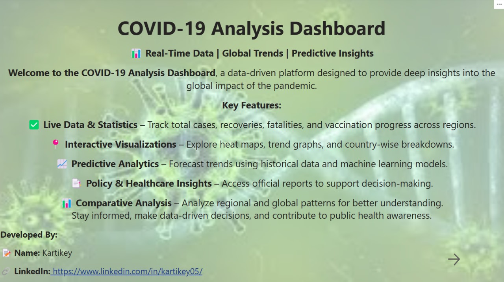
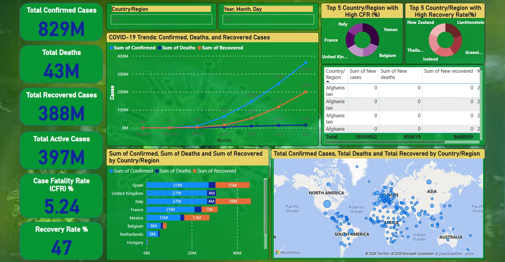

# COVID-19 Analysis Dashboard 📊🌍

Welcome to the **COVID-19 Analysis Dashboard**! This Power BI project provides a comprehensive, data-driven platform to analyze the global impact of the COVID-19 pandemic. With real-time data, interactive visualizations, and predictive insights, this dashboard is designed to help you stay informed and make data-driven decisions.

## 📸 Screenshots

Here are some screenshots of the dashboard:

## 🚀 Key Features

- **Live Data & Statistics**: Track total cases, recoveries, fatalities, and vaccination progress across regions.
- **Interactive Visualizations**: Explore heat maps, trend graphs, and country-wise breakdowns.
- **Predictive Analytics**: Forecast trends using historical data and machine learning models.
- **Policy & Healthcare Insights**: Access official reports to support decision-making.
- **Comparative Analysis**: Analyze regional and global patterns for better understanding.

## 📊 Data Overview

- **Total Confirmed Cases**: 82M
- **Total Active Cases**: 397M
- **Case Fatality Rate (CFR)**: 5.24%
- **Recovery Rate**: 47%

### Country/Region Breakdown

| Country/Region | Sum of Confirmed | Sum of Deaths | Sum of Recovered |
|----------------|------------------|---------------|------------------|
| United Kingdom | 2.7M             | 18M           | -                |
| Italy          | 2.7M             | 8M            | 16M              |
| France         | 2.1M             | 7M            | -                |
| Mexico         | 15M              | 11M           | -                |
| Belgium        | 6M               | -             | -                |
| Netherlands    | 3M               | -             | -                |
| Hungary        | 4M               | -             | -                |

## 👨‍💻 Developed By

- **Name**: Kartikey  
- **LinkedIn**: [Kartikey](https://www.linkedin.com/in/kartikey05/)

## 📝 How to Use

1. Clone this repository to your local machine.
2. Open the Power BI project file.
3. Connect to the data source and refresh the data.
4. Explore the interactive dashboard and visualizations.

---

Stay informed, make data-driven decisions, and contribute to public health awareness! 🌟
